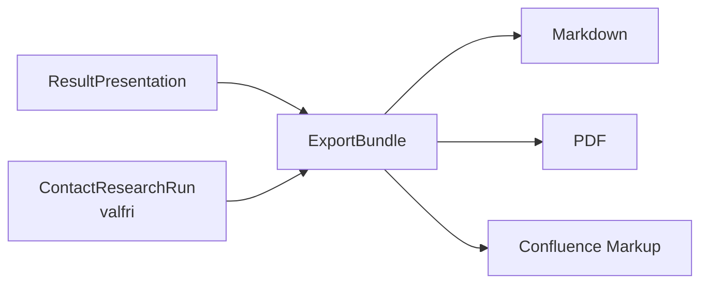

# Exportformat

Steg 10 inför ett gemensamt exportlager för Markdown, PDF och Confluence Markup.

## Princip

Exporten bygger på samma strukturerade data som chattresultatet. Den är därför en renderingsoperation – inte en ny analysfas. Om källdata ändras ska rapporten genereras om, inte manuellt redigeras på olika sätt per format.



## Markdown

Markdown är canonical textrepresentation för export. Den är avsedd både för arkivering och fortsatt bearbetning.

## PDF

PDF är den fristående läsversionen. Den innehåller samma analysdata och kan även innehålla kontaktpersonssektionen. PDF-renderaren använder sidbrytbara tabeller och Unicode-font för svenska tecken.

## Confluence Markup

Confluence-versionen är avsedd för miljöer där klassisk Confluence Wiki Markup kan importeras eller klistras in. Den använder Confluence-rubriker, tabeller, länkar och info-/noteringsmakron.

## Kontaktpersoner

Om `--contacts` anges till exportverktyget läggs verifierade rekommenderade kontaktpersoner och myndighetsfallbacks in efter teknikresultatet. Tidigare anställda presenteras inte som rekommenderade kontakter.

## CLI

```bash
python scripts/export_report.py examples/presentation-result.yaml \
  --contacts examples/contact-candidates.yaml \
  --format all \
  --out-dir out
```

Format kan vara `markdown`, `pdf`, `confluence` eller `all`.

## Paritetskrav

Det är sakparitet – inte pixelidentisk layout – som krävs. Samma myndigheter, räknare, säkerhetsvärden, evidens och kontaktvägar ska återfinnas i samtliga exporterade format.
