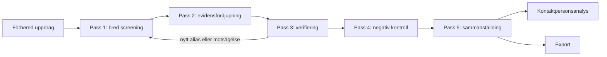

# Researchflöde – Myndighetsteknikradarn

Detta dokument beskriver det end-to-end-flöde som infördes i utvecklingssteg 2.

## Flödesöversikt

## Varför fler pass?

Bred screening och verifiering har olika mål. Första passet ska hitta kandidater med hög täckning. Senare pass ska avgöra vad källorna faktiskt bevisar. Om dessa blandas ihop finns stor risk att en enstaka sökträff felaktigt blir ett påstående om faktisk användning.

## Processstatus per myndighet

Under screening används minst:

- `positive_candidate`
- `no_trace_yet`
- `ambiguous`
- `not_analyzed`

När analysen sammanställs skiljs processstatus från evidensbedömning. Det är centralt för att inte räkna en oanalyserad myndighet som en myndighet där inga spår hittats.

## Batchning

En stor analys får delas upp i batcher. Samma ResearchRun ska fortsätta mellan batcherna och totalsiffror ska byggas från myndigheternas faktiska status. Ett delresultat märks uttryckligen som ofullständigt.

## Nästa beroenden

Steg 2 definierar processen men inte full detaljlogik för:

- produktalias och falska ekvivalenser – steg 3,
- myndighetsuniversum och komplett täckningsmodell – steg 4,
- källhierarki och sökplaner – steg 5,
- evidensschema/deduplicering – steg 6,
- scoring – steg 7.

Dessa komponenter ska plugga in i detta flöde utan att ändra huvudordningen.
