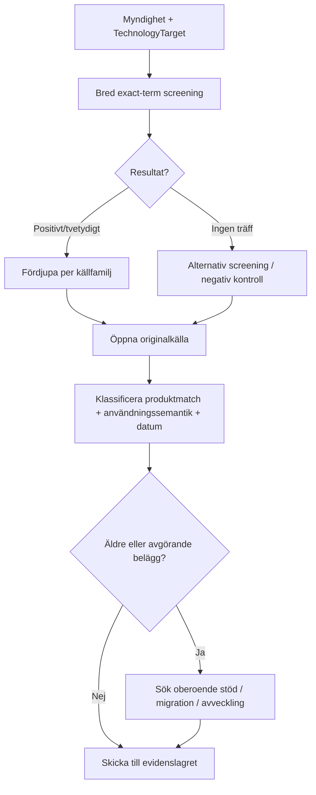

# Källstrategi och sökplaner

## Syfte

Steg 5 gör researchen systematisk utan att låsa GPT:n till en enda sökmotor eller databas. Modellen skiljer mellan **var en träff hittas**, **vilken källtyp originalet har** och **vad källan faktiskt bevisar**.

## Adaptivt sökvattenfall

## Varför adaptivt?

En full källgenomgång för varje myndighet skulle skala dåligt när scope omfattar hundratals organisationer. Screening gör därför ett litet antal högsignal-sökningar först. Positiva eller tvetydiga kandidater får djupare research, medan negativa kandidater får en alternativ kontroll innan de slutligt beskrivs som “inga relevanta spår hittades”.

## Källfamiljer

| Källfamilj | Normal roll | Viktigaste feltolkning att undvika |
|---|---|---|
| Myndighetens webb/dokument | Direkt eller kontextuell evidens | Produkt nämns utan att vara i drift |
| Publik kod | Teknisk implementation/discovery | Repo eller dependency antas vara produktion |
| RFI | Behov/marknadsdialog | RFI tolkas som köp |
| Upphandlingsannons | Avsikt/anskaffningsprocess | Annons tolkas som faktisk användning |
| Tilldelning/avtal/avrop | Anskaffningsspår | Köp tolkas automatiskt som driftsatt system |
| Ramavtal | Möjlig inköpsväg | Centralt ramavtal räknas på varje myndighet |
| Jobbannons | Miljö- eller kompetenssignal | “Meriterande” tolkas som befintlig miljö |
| Professionell profil | Självrapporterad signal | Teknik från annan arbetsgivare/kund kopplas fel |
| Konferens/presentation | Ofta konkret implementation | Gammal presentation behandlas som nuläge |
| Leverantörscase | Konkret men partsintresserat | Marknadsföring behandlas som oberoende bekräftelse |
| Branschpress | Discovery/sekundär verifiering | Sekundäruppgift används utan originalkontroll |
| Söksnippet | Discovery | Snippet behandlas som självständig evidens |

## Upphandlingslandskap

Sverige saknar en enda nationell kommersiell annonsdatabas som täcker allt. Projektets seed-lista är därför tidsstämplad och inkluderar flera registrerade databaser samt TED och offentliga källor. Vid framtida analyser ska aktuell registrering kunna verifieras.

## Sökfamiljer

Sökplanen använder variablerna `{agency_name}`, `{agency_domain}` och `{term}`. Exempel:

- `"Myndigheten" "OpenShift"`
- `site:myndighet.se "OpenShift"`
- `"Myndigheten" "OpenShift" upphandling OR avtal OR avrop`
- `"Myndigheten" "OpenShift" jobb OR "lediga jobb"`
- `"Myndigheten" "OpenShift" kundcase OR reference`
- `"Myndigheten" "OpenShift" migrering OR avveckling`

Exemplen är mönster. Runtime ska anpassa söksyntax efter faktisk söktjänst och inte anta att alla operatorer fungerar överallt.

## Spårbarhet

Varje researchad källa ska minst kunna kopplas till:

- myndighet,
- sökt target/term,
- källtyp,
- original-URL när den går att identifiera,
- datum när det finns,
- vilken sökfamilj som ledde till träffen,
- vad källan semantiskt visar.

Det fulla Evidence-schemat och dedupliceringen implementeras i steg 6.

## Tidsstämplade källor

`knowledge/source-landscape.yaml` är ett seed-set, inte en statisk sanning. När källandskapet ändras ska aktuella registrerade databaser och tjänster verifieras innan en bred analys beskriver sig som komplett.
