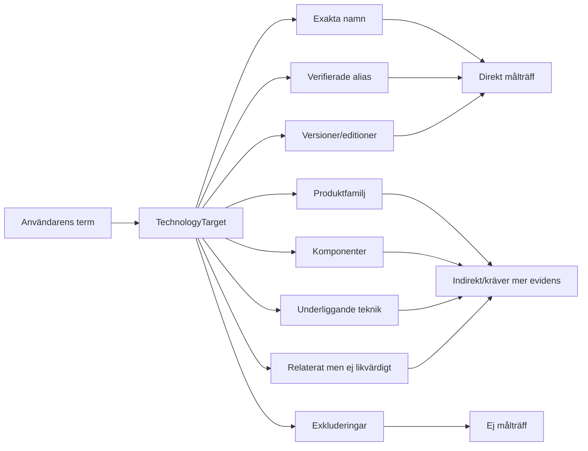

# Teknologinormalisering i Myndighetsteknikradarn

## Varför normalisering behövs

Tekniska produkter förekommer under officiella namn, förkortningar, versionsnamn, tidigare namn och informella benämningar. Samtidigt förekommer närliggande termer som ofta korrelerar med produkten utan att vara bevis för den. Normaliseringen skapar därför ett stabilt mål innan evidensbedömningen börjar.

## Matchklasser

| Matchklass | Direkt produktträff? | Typisk användning |
|---|---|---|
| `exact_target` | Ja | Officiellt produktnamn |
| `verified_alias` | Ja | Entydig förkortning/tidigare officiellt namn |
| `target_version_or_edition` | Ja | Namngiven version/edition av target |
| `family_only` | Nej | Produktfamilj men inte specifik produkt |
| `component_only` | Nej | Delkomponent |
| `underlying_technology_only` | Nej | Teknik produkten bygger på |
| `related_not_equivalent` | Nej | Ekosystem, konkurrent eller närliggande teknik |
| `ambiguous_term` | Nej | Tvetydig term som måste verifieras |
| `excluded_false_match` | Nej | Känd falsk träff |

## Exempel: OpenShift

Om målprodukten är **Red Hat OpenShift Container Platform**:

- `Red Hat OpenShift Container Platform` → `exact_target`
- `OpenShift` i tydlig Red Hat-kontext → `verified_alias`
- `OCP 4.16` i tydlig OpenShift-kontext → `target_version_or_edition`
- `Red Hat Hybrid Cloud` → `family_only` eller `related_not_equivalent` beroende på kontext
- `Kubernetes` → `underlying_technology_only`
- `Rancher` → `related_not_equivalent`
- en orelaterad betydelse av `OCP` → `excluded_false_match`

En Kubernetes-jobbannons kan därför vara värdefull som sökspår men får inte ensam göra myndigheten till en OpenShift-kandidat på produktnivå.

## Exempel: generisk teknik

Om användaren i stället frågar efter **Kubernetes**, är Kubernetes självt target. OpenShift kan då vara ett indirekt belägg på Kubernetes-baserad teknik, men källan måste fortfarande visa att den relevanta OpenShift-versionen faktiskt bygger på Kubernetes och att kontexten gäller användning. Scoring av sådan härledd evidens hanteras i senare steg.

## Effekt på researchflödet

Normalisering görs i `prepare` och används i alla senare pass. Ett nytt verifierat alias kan orsaka en kontrollerad iteration tillbaka till `screen`, men redan färdiga myndigheter ska inte sökas om utan skäl.
